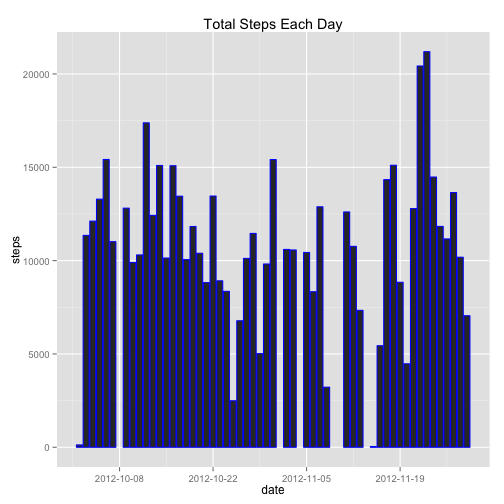
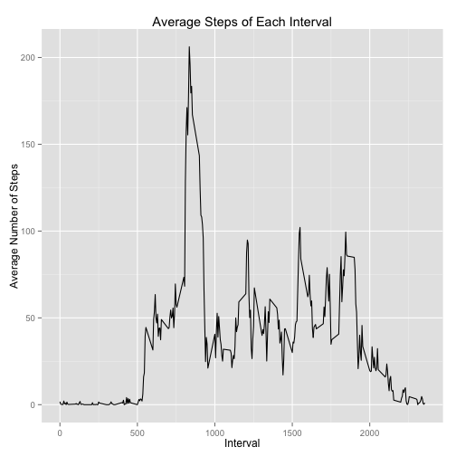
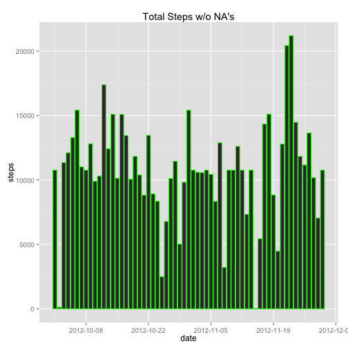
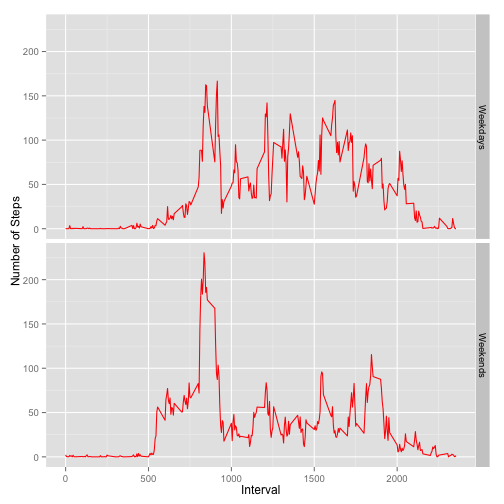

## Course Project 1

### Loading the Data

Assuming the downloaded and unziped file is in your working directory, you can load the data into R using the following code:

```r
data <- read.csv("activity.csv")
```

Make sure plyr and ggplot2 are installed:

```r
library(ggplot2); library(plyr)
```

### Part 1: Plot Total Steps by Date, Calculate the Mean/Median

First, calculate the total number of steps taken per day. 


```r
## Creates a table with the total number of steps taken ## on each date.
table1 <- ddply(data, .variables = "date", summarise, steps = sum(steps))
## Gets rid of NAs
cc <- complete.cases(table1)
table_cc <- table1[cc,]
## Calculates the total steps per day
ave_steps <- mean(table_cc$steps)
ave_steps
```

```
## [1] 10766.19
```

Next, make a histogram of the total steps on each day.


```r
date <- as.Date(table1$date, format = "%Y-%m-%d")
steps <- table1$steps
table2 <- data.frame(date = date, steps = steps) 
g <- ggplot(data = table2, aes(x = date, y = steps))
g <- g + geom_histogram(stat = "identity", col = "blue") + labs(title = "Total Steps Each Day") + scale_x_date(breaks = "2 weeks")
g
```

```
## Warning: Removed 8 rows containing missing values (position_stack).
```

 

Finally, calculate the mean and median number of steps taken per day. 


```r
table3 <- summarise(table_cc, 
                    mean = mean(steps), 
                    median = median(steps))
table3
```

```
##       mean median
## 1 10766.19  10765
```

### Part 2: Average Daily Activity Pattern

Take the average number of steps for each 5 minute interval and make a line graph. 


```r
## Remove any missing values
cc1 <- complete.cases(data)
data_cc <- data[cc1, ]
dat <- ddply(data_cc, .variables = "interval", summarise, mean = mean(steps))
## Make the line graph: 
g1 <- ggplot(data = dat, aes(x = interval, y = mean))
g1 <- g1 + geom_line() + labs(title = "Average Steps of Each Interval") + xlab("Interval") + ylab("Average Number of Steps")
g1
```

 

Which Interval Contains the Most Steps?


```r
ans <- subset(dat, mean == max(mean))
ans
```

```
##     interval     mean
## 104      835 206.1698
```

### Part 3, Replacing Data

I chose to replace the missing data with the mean value for the interval. 


```r
data_add <- mutate(data, int_ave = dat$mean)
data_add$steps[is.na(data_add$steps)] <- data_add$int_ave
```

```
## Warning in data_add$steps[is.na(data_add$steps)] <- data_add$int_ave:
## number of items to replace is not a multiple of replacement length
```

```r
head(data_add)
```

```
##       steps       date interval   int_ave
## 1 1.7169811 2012-10-01        0 1.7169811
## 2 0.3396226 2012-10-01        5 0.3396226
## 3 0.1320755 2012-10-01       10 0.1320755
## 4 0.1509434 2012-10-01       15 0.1509434
## 5 0.0754717 2012-10-01       20 0.0754717
## 6 2.0943396 2012-10-01       25 2.0943396
```

You can see that the "int_ave" column has been copied into the "steps" column, effectively replacing all the NAs with the average value for the interval. 

Now create a histogram:

```r
df <- ddply(data_add, .variables = "date", summarise,
            steps = sum(steps))
df$date <- as.Date(df$date, format = "%Y-%m-%d")
g2 <- ggplot(df, aes(x = date, y = steps))
g2 <- g2 + geom_histogram(stat = "identity", col = "green") + labs(title = "Total Steps w/o NA's") + scale_x_date(breaks = "2 weeks")
g2
```

 

Compute the mean and median: 

```r
table4 <- summarise(df, 
                    mean = mean(steps), 
                    median = median(steps))
table4
```

```
##       mean   median
## 1 10766.19 10766.19
```

Compare table 4 with table 3 from part 1. It looks like filling in the NA's with the mean for the respective intervals doesn't change the mean or median in any meaningful way. 

### Weekdays vs Weekends

I used the timeDate package to do this section. 


```r
library(timeDate)
wd <- mutate(data_add, wd2 = isWeekday(data_add$date))
wd$wd2 <- as.factor(wd$wd2)
```

Create a graph:


```r
df4 <- ddply(wd, .variables = c("wd2", "interval"), summarise, num_steps = mean(steps))
levels(df4$wd2) <- c("Weekdays", "Weekends") 
g3 <- ggplot(data = df4, aes(x = interval, y = num_steps))
g3 <- g3 + facet_grid(wd2 ~ .) + geom_line(col = "red")
g3 <- g3 + ylab("Number of Steps") + xlab("Interval")
g3
```

 
